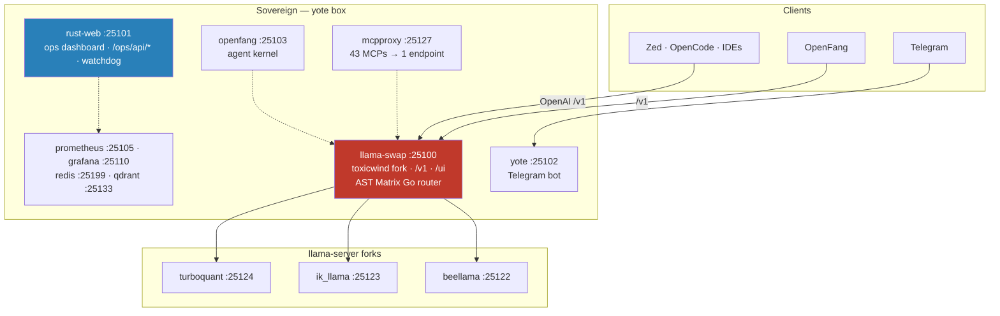

# sovereign

<div align="right">

[](https://github.com/toxicwind/sovereign-projects)
[](https://github.com/toxicwind/sovereign-projects)
[](https://github.com/toxicwind/sovereign/commits/main)
[](https://github.com/toxicwind/sovereign)
[](https://github.com/toxicwind/sovereign)

</div>

> [!CAUTION]
> **This repo is superseded.** `toxicwind/sovereign` is the legacy predecessor of **[toxicwind/sovereign-projects](https://github.com/toxicwind/sovereign-projects)** — the canonical, actively developed monorepo. Its main branch is stale; treat this tree as historical record, not as a live target. New work goes to the successor.

## What this was

**Sovereign** was the self-hosted multi-service stack on the yote box: one OpenAI-compatible LLM front door, an agent kernel, a Telegram bot, an ops dashboard, metrics, and optional Tailscale exposure — all orchestrated with `mise` + `pitchfork` on a single 25xxx port plan.

The idea survived; the tree moved. Everything this repo contained now lives on in **sovereign-projects** — the herd inference router, the mesh MCP federation, the tau agent engine, the yote runtime, the OpenFang kernel, and the shell — reorganized into workspaces with a single source of truth.

## What's in the tree

| Component | Port | Runtime | Role |
|---|---|---|---|
| **llama-swap** | **25100** | Go (toxicwind fork) | The one LLM front door: `/v1` OpenAI API, `/ui` chat UI, `/models/sse` — with an AST Matrix Go router (6 routing strategies, ELO scoring, circuit breakers) ported in-fork |
| **rust-web** | **25101** | Rust | Ops dashboard + embedded watchdog, `/ops/api/*` APIs, `/health` |
| **yote** | 25102 | Bun | Telegram bot / status |
| **openfang** | **25103** | Rust (binary) | Agent kernel — OpenFang OS, Discord bridge |
| **prometheus** | 25105 | Go | Metrics |
| **hf-downloader** | 25106 | Bun | GGUF download UI |
| **null-g-proxy** | 25107 | Bun | Extra LLM proxy |
| **grafana** | 25110 | Go | Dashboards |
| **ghas-api** | 25112 | Bun | GitHub Advanced Search API |
| **ghas-mcp** | 25113 | Bun | GHAS MCP (HTTP mode, depends on ghas-api) |
| **mesh-hub** | 25115 | Bun | Service mesh features across services |
| **mcp-gateway** | 25120 | — | MCP gateway |
| **byte-vision** | 25121 | Go binary | Vision MCP (OCR / screenshot analysis) |
| **mcpproxy** | 25127 | Go | MCP federation (43 MCPs → 1 endpoint) |
| **qdrant** | 25133 | — | Vector store (`0.0.0.0`) |
| **redis** | 25199 | Redis | Session cache, telemetry backing store |

llama-swap backends (llama-server forks): **beellama** `:25122` · **ik_llama** `:25123` · **turboquant** `:25124`

Tooling kept in-tree: the standalone TypeScript **sovereign-router** (`tools/sovereign-router/`), the agentic-runtime **sovereign-monitor** (`tools/sovereign-monitor/` — recursive-fallback, watchdog, repo-radar), the **repo-audit** skill (`skills/repo-audit/`), and the **maximal-sovereign-agentic-audit** framework (`src/maximal-sovereign-agentic-audit/`). Orchestration: `mise.toml` tasks + `pitchfork.toml` groups (`core`, `herd`, `qdrant`, `redis`, …), port SSOT in `config/ports.env`.

## Architecture



No reverse proxy: there was never Caddy or a separate landing service here — every service bound its own stable 25xxx port, `0.0.0.0` for LAN/Tailscale access (internal mesh-front backends stayed on `127.0.0.1:252xx`). Optional Tailscale Funnel pointed at rust-web only (`tailscale/README.md`).

## Quick start

This tree is historical — the successor is where work happens:

```bash
git clone https://github.com/toxicwind/sovereign-projects.git   # the live repo
```

The predecessor, for reference only:

```bash
git clone https://github.com/toxicwind/sovereign.git
```

## Architecture (continued)

- **Inference chain:** `clients (Zed / OpenFang / Grok / IDEs) → llama-swap :25100 (toxicwind fork) → beellama :25122 | ik_llama :25123 | turboquant :25124`
- **AST Matrix Go port** inside the llama-swap fork: 6 strategies (hybrid, ast_race, sticky_affinity, weighted_elo, circuit_chain, fifo_matrix), ELO scoring with circuit breaker (closed/open/half), SQLite WAL health DB, 7 providers (llama-swap local, OpenRouter, NVIDIA NIM, Groq, Cerebras, Google, Mistral), 40+ model aliases. The standalone Bun `sovereign-router` (`tools/sovereign-router/`) stayed in-tree for external tooling; it had no SSOT port and was never started by `mise run up`.
- **Sovereign Monitor** (`tools/sovereign-monitor/`): kernel-aware, autonomous failure-recovery primitives for the agent loop — `recursive-fallback.ts` (multi-level try/catch, recursive decomposition, watchdog escalation), `watchdog.ts` (bounded agentic-loop watchdog: judge → SIGINT → SIGKILL escalation, audit trail), `repo-radar.ts` (autonomous repo discovery via GHAS queries, novelty scoring).
- **Audit frameworks:** the `repo-audit` skill (`skills/repo-audit/` — remote GitHub analysis via `gh` CLI, local `/home/toxic/projects` scans, CSV/Parquet/JSON output) and the maximal modular audit framework (`src/maximal-sovereign-agentic-audit/` — precheck, autofix, git-scanner, parquet export, LLM-assisted `--completions` analysis).
- **Hot reload:** `cargo watch` for rust-web (`stack/services/rust-web-hot.sh`), `bun --hot` for Bun services, lifecycle reload for prometheus, `mise run restart-llama` for llama-swap. After editing a process module: `mise run down && mise run up` (pitchfork reads config at start).
- **Docs:** `docs/` holds the architecture and research corpus — `ARCHITECTURE.md` (the hardware/memory/swap single source of truth), `CONTROL_PLANE.md`, `UNIVERSAL_ARCHITECTURE.md`, `STORAGE_TIERING_AND_CACHE_ARCHITECTURE.md`, `SWAP_OPTIMIZATION.md`, `NVIDIA_NIM_API_DOCS.md`, `KIMI_CODE_FORK_RESEARCH.md`, `MANIFESTO.md`, and more.

## Config & optional services

| Source | Contents |
|---|---|
| **`config/ports.env`** | Port SSOT (all 25xxx; never invent port numbers in app code — use env, `src/lib/ports.ts`, or `stack/lib-ports.sh`) |
| **`.env.local`** | Optional overrides / build flags |
| **`~/.secrets`** | Secrets (not in git) |

Optional services (started via pitchfork groups or `up:all`, not all in the `core` group): **Tailscale Funnel** exposure (Funnel → rust-web only, no multipath), **Grafana** dashboards, **GHAS** search API+MCP, **mesh-hub**, **byte-vision** OCR, **qdrant** + **redis** backing stores, **NVIDIA NIM** provider routing.

## Dev & contributing

```bash
bun test                  # all tests (tests/, 131+ tests across 9 files)
bun run test:cov          # coverage ≥88% enforced (text + lcov)
bun run test:best-models  # model SSOT tests (live integration)
mise run doctor           # pitchfork + ports + hot-reload core + ast-grep pin
mise run health           # curl probes for key ports
mise run status           # pitchfork list + 25xxx listeners
```

This repo is archived — contributions go to [sovereign-projects](https://github.com/toxicwind/sovereign-projects). This tree used conventional commits (`commitlint.config.js`, husky pre-commit hooks, commitlint v21) and Bun (`package.json`, `bun.lock`, `biome.json`).

## License & security

- **No `LICENSE` file exists at the repo root.** `package.json` declares `"license": "ISC"`; the prior README's statement stands: *"Stack glue: MIT where marked. Upstream binaries retain their licenses (llama-swap, Zed, Grafana, etc.)."* See the successor repo for current licensing.
- No app auth. Treat as **localhost + Tailscale** only — never expose `:25100` / `:25101` to the open internet without your own gate.
- Host firewall should drop public input; open only LAN/tailnet as you choose.
- Secrets lived in `~/.secrets`, never in git.
